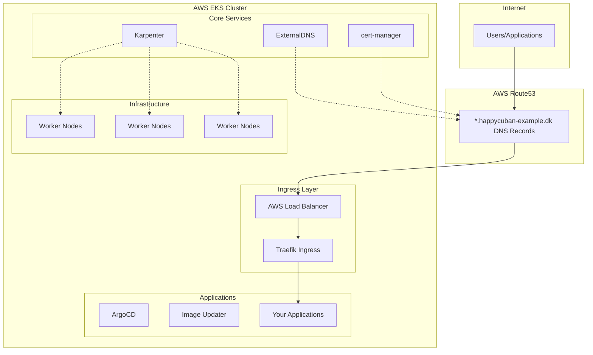

# EKS Cluster with Karpenter - Example Configuration

> **⚠️ EXAMPLE REPOSITORY**: This is a template/example configuration using placeholder values. Replace all domain names, hosted zone IDs, and AWS account-specific settings with your own values before deployment.

> **Example Amazon EKS cluster** with modern **Pod Identity** authentication, automated DNS management, and GitOps capabilities. Perfect for learning and production environments.

## 📋 Quick Start Checklist

1. **�️ Create S3 Bucket**: Run `global/create-bucket` to create Terraform state bucket FIRST
2. **�🔧 Configure Variables**: Copy `.tfvars.example` files and customize with your values
3. **🌐 Domain Setup**: Configure your domain in `terraform.tfvars`
4. **☁️ AWS Setup**: Configure Route53 hosted zone and update terraform variables
5. **🚀 EKS Deployment**: Run deployment commands from environment directories

## 📖 Table of Contents

- [Overview](#overview)
- [Architecture](#architecture)
- [Features](#features)
- [Prerequisites](#prerequisites)
- [Configuration](#configuration)
- [Deployment](#deployment)
- [Services & Components](#services--components)
- [Usage Examples](#usage-examples)
- [Troubleshooting](#troubleshooting)

---

## �️ Overview

This Terraform configuration deploys a **production-ready Amazon EKS cluster** with the following key characteristics:

- **🔐 Security First**: 100% Pod Identity authentication (no hardcoded AWS credentials)
- **📈 Auto-Scaling**: Karpenter for intelligent node provisioning
- **🌐 Single Load Balancer Architecture**: Traefik as single entry point with wildcard TLS
- **🔒 TLS Everywhere**: Wildcard `*.happycuban-example.dk` certificate for all services
- **⚡ Cost-Optimized**: One AWS Load Balancer - Traefik handles all routing internally
- **🔄 GitOps Ready**: ArgoCD web UI accessible at `https://argocd.happycuban-example.dk`

### Cluster Specifications

| Component | Version | Purpose |
|-----------|---------|---------|
| **Kubernetes** | `1.28+` | Container orchestration |
| **Region** | `eu-central-1` | AWS region (configurable) |
| **Network** | VPC with public/private/intra subnets | Multi-AZ deployment |
| **Domain** | `*.happycuban-example.dk` | Example wildcard domain management |

---

## 🏛️ Architecture



### Network Architecture

- **Public Subnets**: Single AWS Load Balancer and NAT Gateway
- **Private Subnets**: EKS worker nodes
- **Intra Subnets**: Internal services (databases, etc.)

### 💡 **Cost-Optimized Single Load Balancer Design**

Instead of creating separate load balancers for each service, we use **one AWS Load Balancer** with Traefik handling all internal routing:

```
Internet → Single AWS ALB → Traefik → Internal Services
         ($18/month)      (Free)    (ArgoCD, Apps, etc.)
```

**Benefits:**
- ✅ **Cost Savings**: ~$18/month for one load balancer vs $18/service
- ✅ **Wildcard TLS**: One `*.happycuban-example.dk` certificate covers all services  
- ✅ **Centralized Routing**: Traefik manages all HTTP/HTTPS routing
- ✅ **Easy Service Addition**: New services just need IngressRoute manifests
- ✅ **Consistent Security**: HTTP→HTTPS redirect for all services

---

## ⭐ Features

### 🔐 Security & Authentication
- **Pod Identity**: Secure AWS service authentication (replaces IRSA/hardcoded keys)
- **RBAC**: Kubernetes Role-Based Access Control
- **Network Security**: Security groups and NACLs
- **IP Access Control**: Optional cluster access restrictions by IP address/CIDR blocks
- **TLS Certificates**: Automatic Let's Encrypt certificates

### � Auto-Scaling & Performance
- **Karpenter**: Intelligent node provisioning and scaling
- **Cluster Autoscaler**: Pod-based scaling decisions
- **Multi-AZ**: High availability across availability zones
- **Spot Instances**: Cost optimization with mixed instance types

### 🌐 Smart Networking Architecture
- **Single Load Balancer**: One AWS Load Balancer for all traffic (cost-efficient)
- **Traefik IngressRoutes**: Internal routing with wildcard `*.happycuban-example.dk` TLS certificate
- **Automatic HTTPS**: HTTP to HTTPS redirect middleware for all services
- **Service Examples**: 
  - ArgoCD: `https://argocd.happycuban-example.dk`
  - Traefik Dashboard: `https://traefik.happycuban-example.dk`
  - Future services: `https://service-name.happycuban-example.dk`
- **ExternalDNS**: Manages DNS records only for the main Traefik load balancer

### 🔄 GitOps & CI/CD
- **ArgoCD**: GitOps continuous deployment
- **Image Updater**: Automatic image updates
- **GitHub Actions**: CI/CD integration with OIDC authentication
- **Helm**: Package management

---

## 📁 Repository Structure

```
eks-karpenter/
├── README.md                    # This documentation
├── Taskfile.yml                 # Task automation (make-like)
├── .taskfile-completion.zsh     # Zsh completion for tasks  
├── .github/workflows/           # CI/CD GitHub Actions
│   ├── release.yaml             # Automated releases (ACTIVE)
│   └── eks-terraform.yml.example # Example deployment workflow (DISABLED)
├── environments/                # Environment-specific configurations
│   ├── dev/                     # Development environment
│   │   ├── terraform.tfvars.example # Example variables (COPY & CUSTOMIZE)
│   │   ├── variables.tf         # Variable definitions
│   │   ├── main.tf             # Main Terraform configuration
│   │   ├── outputs.tf          # Output values
│   │   └── backend.tf          # S3 backend configuration
│   └── pro/                     # Production environment
│       ├── terraform.tfvars.example # Example variables (COPY & CUSTOMIZE)
│       ├── variables.tf         # Variable definitions
│       ├── main.tf             # Main Terraform configuration
│       ├── outputs.tf          # Output values
│       └── backend.tf          # S3 backend configuration
├── modules/                     # Reusable Terraform modules
│   ├── aws_iam/                 # IAM roles and policies
│   ├── aws_organizations/       # AWS Organizations setup
│   ├── ebs-csi/                 # EBS CSI driver with Pod Identity
│   ├── ecr/                     # Elastic Container Registry
│   ├── efs-csi/                 # EFS CSI driver with Pod Identity
│   ├── eks-karpenter/          # EKS cluster with Karpenter
│   ├── github-oidc-provider/   # GitHub OIDC for CI/CD
│   ├── kms-key/                # KMS encryption keys
│   └── s3/                     # S3 buckets and policies
├── global/                     # Global/shared resources
│   ├── create-bucket/          # 🚨 S3 state bucket creation (RUN FIRST)
│   │   ├── main.tf             # Bucket creation configuration
│   │   ├── variables.tf        # Bucket variables
│   │   ├── outputs.tf          # Bucket outputs
│   │   └── terraform.tfvars.example # Example bucket config (COPY & CUSTOMIZE)
│   ├── repos-ecr/              # 📦 ECR container registries (OPTIONAL)
│   │   ├── main.tf             # ECR repository configuration
│   │   ├── variables.tf        # ECR variables
│   │   ├── outputs.tf          # ECR outputs  
│   │   ├── backend.tf          # S3 backend configuration
│   │   └── terraform.tfvars.example # Example ECR config (COPY & CUSTOMIZE)
│   └── github-oidc/            # GitHub OIDC provider setup (OPTIONAL)
│       ├── main.tf             # OIDC provider configuration
│       ├── variables.tf        # OIDC variables
│       ├── outputs.tf          # OIDC outputs
│       ├── backend.tf          # S3 backend configuration
│       └── terraform.tfvars.example # Example OIDC config (COPY & CUSTOMIZE)
└── k8s-argo-apps/             # Kubernetes ArgoCD applications
    ├── application.yaml        # ArgoCD application manifests
    └── stateful-app.yaml      # Example stateful application
```

---

## 📋 Prerequisites

### Required Tools
```bash
# Install required CLI tools
aws --version          # AWS CLI v2
terraform --version    # Terraform >= 1.0
kubectl version        # kubectl
helm version          # Helm v3 (optional)
task --version         # Taskfile (optional but recommended)
```

### AWS Prerequisites
- AWS Account with appropriate permissions
- Route53 hosted zone configured (replace `happycuban-example.dk` with your domain)
- AWS credentials configured (`aws configure`)

### Required Terraform Providers
- `hashicorp/aws`
- `hashicorp/kubernetes`
- `hashicorp/helm`
- `alekc/kubectl`

---

## 🔧 Configuration

> **⚠️ IMPORTANT**: This repository uses `.tfvars.example` files with placeholder values. You MUST copy these to `.tfvars` files and customize with your actual values before deployment.

> **⚠️ DOMAIN**: This example uses placeholder domain `happycuban-example.dk`. Simply update the domain in your `terraform.tfvars` file - no need to search and replace throughout files.

### 1. Copy Example Configuration Files

```bash
# Development environment
cp environments/dev/terraform.tfvars.example environments/dev/terraform.tfvars

# Production environment  
cp environments/pro/terraform.tfvars.example environments/pro/terraform.tfvars

# GitHub OIDC configuration (OPTIONAL - only for CI/CD)
cp global/github-oidc/terraform.tfvars.example global/github-oidc/terraform.tfvars
```

### 2. Customize Configuration Values

Edit `environments/dev/terraform.tfvars` with your actual values:

```terraform
# AWS Configuration
region = "us-west-2"  # Your preferred AWS region
bucket = "terraform-state-2025"  # Must match backend.tf bucket name

# GitHub Repositories (for OIDC integration)
github_repos = [
  "your-infrastructure-repo",
  "your-apps-repo"
]

# EKS Cluster Configuration
cluster_name = "my-demo-eks-cluster"  # Your desired cluster name

# DNS Configuration (CRITICAL - Must configure your own domain)
hosted_zone_id = "ZXXXXXXXXXXXXXXXXXXXXX"  # Your Route53 hosted zone ID
domain_name = "yourdomain.com"  # Replace with your actual domain
subject_alternative_names = "*.yourdomain.com"  # Wildcard certificate

# Environment & Project
environment = "dev"
project_name = "your-infrastructure"  # Your project name

# Network Configuration
private_subnets = ["10.0.1.0/24", "10.0.2.0/24", "10.0.3.0/24"]
public_subnets = ["10.0.101.0/24", "10.0.102.0/24", "10.0.103.0/24"]
intra_subnets = ["10.0.104.0/24", "10.0.105.0/24", "10.0.106.0/24"]

# Security Configuration (Optional)
restrict_cluster_access = false  # Set to true to enable IP restrictions
additional_allowed_ips = [
  # "203.0.113.0/24",  # Example: Company office network
  # "198.51.100.1/32", # Example: VPN gateway IP
]
```

> **⚠️ CRITICAL**: The `bucket` name in your `terraform.tfvars` **must exactly match** the hardcoded `bucket` name in `environments/dev/backend.tf`. Terraform backend configuration cannot use variables!

⚠️ **Important**: 
- Never commit `*.tfvars` files to git - they contain sensitive data!
- The `.gitignore` file is configured to block `*.tfvars` files automatically
- Always use `.tfvars.example` files as templates

---

## 🚀 Deployment

> **🚨 PREREQUISITE**: You MUST create the S3 bucket first using [`global/create-bucket`](global/create-bucket/) before any environment deployment. This bucket stores Terraform state for all environments. See detailed instructions: [`global/create-bucket/README.md`](global/create-bucket/README.md)

> **🔗 OPTIONAL CI/CD**: If you want to use GitHub Actions for CI/CD:
> 1. Deploy the GitHub OIDC provider first - see [`global/github-oidc/README.md`](global/github-oidc/README.md)
> 2. Configure the GitHub Actions workflow - see [`.github/workflows/eks-terraform.yml.example`](.github/workflows/eks-terraform.yml.example)

> **📦 OPTIONAL ECR**: If you want AWS container registries for your Docker images:
> - Deploy ECR repositories - see [`global/repos-ecr/README.md`](global/repos-ecr/README.md)

### 🚨 STEP 0: Create S3 Bucket (REQUIRED FIRST)

> **⚠️ CRITICAL**: This step MUST be completed before any other deployment steps. All environments depend on this bucket for Terraform state storage.

```bash
# Navigate to bucket creation directory
cd global/create-bucket

# Copy and customize configuration
cp terraform.tfvars.example terraform.tfvars
# Edit terraform.tfvars with your unique bucket name and region

# Create the S3 bucket (this is the foundation for all other deployments)
terraform init
terraform plan
terraform apply

# ⚠️ IMPORTANT: Update backend.tf files in ALL environments with your actual bucket name
# Replace "terraform-state-2025" with your bucket name in:
# - environments/dev/backend.tf
# - environments/pro/backend.tf
# - global/github-oidc/backend.tf (if using CI/CD)
```

### Option 1: Using Taskfile

```bash
# Install Taskfile (if not already installed)
# macOS
brew install go-task/tap/go-task

# Linux
sh -c "$(curl --location https://taskfile.dev/install.sh)" -- -d -b ~/.local/bin

# Windows
choco install go-task

# Show available tasks
task --list

# Deploy development environment
task deploy ENV=dev

# Check cluster health
task health ENV=dev

# Access services
task argocd-ui ENV=dev        # ArgoCD UI
task argocd-password ENV=dev  # Get ArgoCD password
```

### Option 2: Manual Terraform Commands (Recommended)

```bash
# Navigate to environment directory
cd environments/dev

# Initialize Terraform
terraform init

# Plan deployment (review changes)
terraform plan

# Apply infrastructure
terraform apply

# Configure kubectl
aws eks update-kubeconfig --region eu-central-1 --name eks-cluster
```

### 3. Verify Deployment

```bash
# Check cluster status
kubectl get nodes
kubectl get pods --all-namespaces

# Access ArgoCD
echo "ArgoCD URL: https://argocd.happycuban-example.dk"
kubectl -n argocd get secret argocd-initial-admin-secret -o jsonpath="{.data.password}" | base64 -d

# Monitor Karpenter scaling
kubectl logs -f -n karpenter deployment/karpenter
```

---

## 🌐 Services & Components

After successful deployment, the following services will be available:

| Service | URL | Purpose |
|---------|-----|---------|
| **ArgoCD** | `https://argocd.happycuban-example.dk` | GitOps deployment management |
| **Traefik Dashboard** | `https://traefik.happycuban-example.dk` | Load balancer and routing status |
| **Your Apps** | `https://app-name.happycuban-example.dk` | Your deployed applications |

### 🔐 Default Credentials

```bash
# ArgoCD Admin Password
kubectl -n argocd get secret argocd-initial-admin-secret -o jsonpath="{.data.password}" | base64 -d

# Username: admin
# Password: (output from above command)
```

### 📊 Monitoring & Health Checks

```bash
# Cluster health
kubectl get nodes
kubectl get pods --all-namespaces

# Karpenter status
kubectl get deployment -n karpenter
kubectl logs -f -n karpenter deployment/karpenter

# ArgoCD applications
kubectl get applications -n argocd
```

---

## �️ Troubleshooting

### Common Issues

#### 1. Domain/DNS Issues
```bash
# Check if your domain is properly configured
nslookup argocd.happycuban-example.dk

# Verify Route53 hosted zone
aws route53 list-hosted-zones
```

#### 2. ArgoCD Access Problems
```bash
# Check ArgoCD pods
kubectl get pods -n argocd

# Reset ArgoCD admin password
kubectl -n argocd patch secret argocd-secret \
  -p '{"stringData": {"admin.password": "$2a$10$rRyBsGSHK6.uc8fntPwVIuLVHgsAhAX7TcdrqW/RADU0uyV5Byvih","admin.passwordMtime": "'$(date +%FT%T%Z)'"}}'
# Password: password
```

#### 3. Terraform State Issues
```bash
# Check S3 backend access
aws s3 ls s3://terraform-state-2025

# Force unlock if needed
terraform force-unlock <lock-id>
```

#### 4. Karpenter Not Scaling
```bash
# Check Karpenter logs
kubectl logs -f -n karpenter deployment/karpenter

# Verify node pool configuration
kubectl get nodepool
```

### 🆘 Support

- **GitHub Issues**: [Report bugs and request features](https://github.com/happycuban/eks-karpenter/issues)
- **Documentation**: Each module has its own README with detailed configuration options
- **AWS EKS Documentation**: [Official AWS EKS documentation](https://docs.aws.amazon.com/eks/)

---

## 🙏 Acknowledgments

This project was inspired by and builds upon excellent work from the community:

- **[antonputra/tutorials](https://github.com/antonputra/tutorials/tree/268/lessons/268)** - EKS and Karpenter implementation patterns
- **[sahibgasimov/eks-terraform-stable](https://github.com/sahibgasimov/eks-terraform-stable)** - Stable EKS Terraform configurations

Special thanks for sharing their knowledge and best practices with the community.

---

### Documentation
- [Karpenter Documentation](https://karpenter.sh/)
- [ArgoCD Documentation](https://argo-cd.readthedocs.io/)
- [Traefik Documentation](https://doc.traefik.io/)
- [AWS EKS Best Practices](https://aws.github.io/aws-eks-best-practices/)

---

## 📋 Repository Information

**Repository:** `eks-karpenter`  
**GitHub:** `https://github.com/happycuban/eks-karpenter`  
**License:** MIT    

### Key Features Checklist
- ✅ **Production Ready** - Battle-tested in high-traffic environments
- ✅ **Cost Optimized** - Single load balancer design with Karpenter autoscaling
- ✅ **Security First** - Pod Identity, KMS encryption, network isolation
- ✅ **GitOps Enabled** - ArgoCD for declarative application management
- ✅ **Developer Friendly** - Comprehensive automation and clear documentation
- ✅ **Highly Available** - Multi-AZ deployment with automatic failover

**🚀 Ready to deploy enterprise-grade Kubernetes infrastructure with modern AWS services!**

