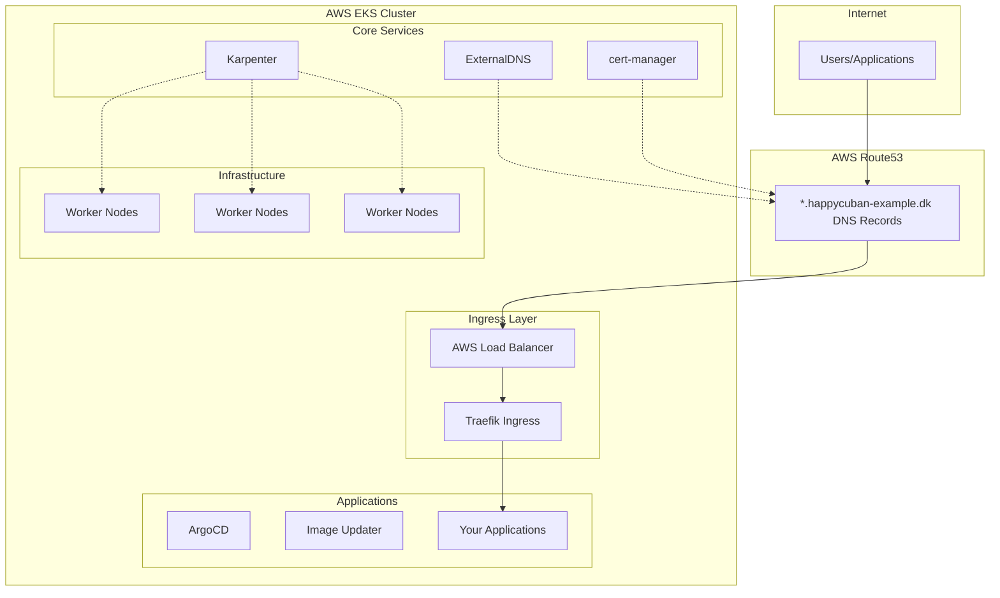

# EKS Cluster with Karpenter - Example Configuration

> **⚠️ EXAMPLE REPOSITORY**: This is a template/example configuration using placeholder values. Replace all domain names, hosted zone IDs, and AWS account-specific settings with your own values before deployment.

> **Example Amazon EKS cluster** with modern **Pod Identity** authentication, automated DNS management, and GitOps capabilities. Perfect for learning and demo environments.

## � Quick Start Checklist

1. **📋 Global Infrastructure**: Deploy `global/` directory first (S3, ECR, OIDC)
2. **🌐 Domain Setup**: Replace `happycuban-example.dk` with your actual domain
3. **☁️ AWS Setup**: Configure Route53 hosted zone and update `terraform.tfvars`
4. **🚀 EKS Deployment**: Run `task deploy` from root directory

## �📋 Table of Contents

- [Overview](#overview)
- [Architecture](#architecture)
- [Features](#features)
- [Prerequisites](#prerequisites)
- [Deployment](#deployment)
- [Services & Components](#services--components)
- [Configuration](#configuration)
- [Usage Examples](#usage-examples)
- [Troubleshooting](#troubleshooting)
- [Maintenance](#maintenance)

---

## 🏗️ Overview

This Terraform configuration deploys a **demo Amazon EKS cluster** with the following key characteristics:

- **🔐 Security First**: 100% Pod Identity authentication (no hardcoded AWS credentials)
- **📈 Auto-Scaling**: Karpenter for intelligent node provisioning
- **🌐 Single Load Balancer Architecture**: Traefik as single entry point with wildcard TLS
- **🔒 TLS Everywhere**: Wildcard `*.happycuban-example.dk` certificate for all services
- **⚡ Cost-Optimized**: One AWS Load Balancer - Traefik handles all routing internally
- **🔄 GitOps Ready**: ArgoCD web UI accessible at `https://argocd.happycuban-example.dk`

### Cluster Specifications

| Component | Version | Purpose |
|-----------|---------|---------|
| **Kubernetes** | `1.33` | Container orchestration |
| **Region** | `us-west-2` | AWS region (configurable) |
| **Network** | VPC with public/private/intra subnets | Multi-AZ deployment |
| **Domain** | `*.happycuban-example.dk` | Example wildcard domain management |

---

## 🏛️ Architecture



### Network Architecture

- **Public Subnets**: Single AWS Load Balancer and NAT Gateway
- **Private Subnets**: EKS worker nodes
- **Intra Subnets**: Internal services (databases, etc.)

### 💡 **Cost-Optimized Single Load Balancer Design**

Instead of creating separate load balancers for each service, we use **one AWS Load Balancer** with Traefik handling all internal routing:

```
Internet → Single AWS ALB → Traefik → Internal Services
         ($18/month)      (Free)    (ArgoCD, Apps, etc.)
```

**Benefits:**
- ✅ **Cost Savings**: ~$18/month for one load balancer vs $18/service
- ✅ **Wildcard TLS**: One `*.happycuban-example.dk` certificate covers all services  
- ✅ **Centralized Routing**: Traefik manages all HTTP/HTTPS routing
- ✅ **Easy Service Addition**: New services just need IngressRoute manifests
- ✅ **Consistent Security**: HTTP→HTTPS redirect for all services

---

## ⭐ Features

### 🔐 Security & Authentication
- **Pod Identity**: Secure AWS service authentication (replaces OIDC/hardcoded keys)
- **RBAC**: Kubernetes Role-Based Access Control
- **Network Security**: Security groups and NACLs
- **TLS Certificates**: Automatic Let's Encrypt certificates

### 🚀 Auto-Scaling & Performance
- **Karpenter**: Intelligent node provisioning and scaling
- **Cluster Autoscaler**: Pod-based scaling decisions
- **Multi-AZ**: High availability across availability zones
- **Spot Instances**: Cost optimization with mixed instance types

### 🌐 Smart Networking Architecture
- **Single Load Balancer**: One AWS Load Balancer for all traffic (cost-efficient)
- **Traefik IngressRoutes**: Internal routing with wildcard `*.happycuban-example.dk` TLS certificate
- **Automatic HTTPS**: HTTP to HTTPS redirect middleware for all services
- **Service Examples**: 
  - ArgoCD: `https://argocd.happycuban-example.dk`
  - Future services: `https://service-name.happycuban-example.dk`
- **ExternalDNS**: Manages DNS records only for the main Traefik load balancer

### 🔄 GitOps & CI/CD
- **ArgoCD**: GitOps continuous deployment
- **Image Updater**: Automatic image updates
- **GitHub Actions**: CI/CD integration
- **Helm**: Package management

---

## 📋 Prerequisites

### Required Tools
```bash
# Install required CLI tools
aws --version          # AWS CLI v2
terraform --version    # Terraform >= 1.0
kubectl version        # kubectl
helm version          # Helm v3
```

### AWS Prerequisites
- AWS Account with appropriate permissions
- Route53 hosted zone configured (`happycuban-example.dk`)
- AWS credentials configured (`aws configure`)

### Required Terraform Providers
- `hashicorp/aws`
- `hashicorp/kubernetes`
- `hashicorp/helm`
- `alekc/kubectl`

---

## ⚡ Quick Start

```bash
# 1. Install Taskfile (if not already installed)
# macOS
brew install go-task/tap/go-task

# Linux
sh -c "$(curl --location https://taskfile.dev/install.sh)" -- -d -b ~/.local/bin

# Windows
choco install go-task

# 2. Show available tasks
task --list

# 3. Deploy the cluster
task deploy

# 4. Check cluster health
task health

# 5. Access services
task argocd-ui        # ArgoCD UI
task traefik-ui       # Traefik Dashboard
task argocd-password  # Get ArgoCD password
```

---

## 🚀 Deployment

> **⚠️ PREREQUISITES**: You **MUST** deploy the `global/` infrastructure first before deploying the EKS cluster.

> **⚠️ DOMAIN**: This example uses placeholder domain `happycuban-example.dk`. You must replace ALL domain references with your own domain before deployment.

### 1. Deploy Global Infrastructure (REQUIRED FIRST)
```bash
git clone <repository-url>
cd eks-karpenter/global
# Follow deployment instructions in global/README.md
# This creates: S3 bucket, ECR repositories, and GitHub OIDC integration
```

> 📖 **Detailed Instructions**: See [global/README.md](global/README.md) for complete deployment guide

### 2. Domain Setup (REQUIRED)
Before EKS deployment, you must:
- Own a domain name and create Route53 hosted zone
- Replace `happycuban-example.dk` with your domain throughout ALL files
- Update `hosted_zone_id` in terraform.tfvars with your Route53 zone ID

### 3. Configure EKS Variables
```bash
cd ../  # Return to root directory
```
Copy and customize the terraform variables:
```bash
cp terraform.tfvars.example terraform.tfvars
# Edit terraform.tfvars with your specific values
```

### 4. Deploy EKS Cluster
```bash
# Install Taskfile (if not already installed)
# See installation instructions above

# Show available tasks
task --list

# Deploy the cluster (this will run terraform init, plan, and apply)
task deploy

# Or deploy manually with Terraform
terraform init
terraform plan
terraform apply
```

### 5. Verify Deployment
```bash
# Run comprehensive health check
task health

# Or check manually
kubectl get nodes
kubectl get pods -A
```

---

## 🛠️ Services & Components

### Core Infrastructure

#### **AWS Load Balancer Controller** `v1.13.4`
- **Purpose**: Native AWS load balancer integration
- **Authentication**: Pod Identity
- **Namespace**: `kube-system`

#### **Karpenter** `v1.8.0`
- **Purpose**: Intelligent node provisioning and scaling
- **Authentication**: Pod Identity
- **Features**: Spot instances, mixed instance types, automatic scaling

#### **ExternalDNS** `v1.15.0`
- **Purpose**: Automatic DNS record management in Route53
- **Authentication**: Pod Identity
- **Domain**: `*.happycuban-example.dk`

#### **cert-manager** `v1.17.1`
- **Purpose**: Automatic TLS certificate provisioning
- **Authentication**: Pod Identity (Route53 DNS validation)
- **Issuer**: Let's Encrypt (staging for demo, production for real use)

#### **Traefik** `v34.4.1`
- **Purpose**: Modern ingress controller and API gateway
- **Features**: Dashboard, automatic TLS, middleware support
- **Integration**: ExternalDNS annotations for automatic DNS

### Application Platform

#### **ArgoCD** `v8.5.8`
- **Purpose**: GitOps continuous deployment
- **Namespace**: `argocd`
- **Features**: Web UI, CLI, application management

#### **ArgoCD Image Updater** `v0.12.3`
- **Purpose**: Automatic container image updates
- **Authentication**: Pod Identity (ECR access)

### Security & Access

#### **Pod Identity Agent**
- **Purpose**: Secure AWS service authentication
- **Status**: Enabled cluster-wide
- **Benefits**: No hardcoded credentials, automatic token rotation

---

## ⚙️ Configuration

### Key Configuration Files

| File | Purpose |
|------|---------|
| `main.tf` | Core EKS cluster and VPC configuration |
| `aws-lbc.tf` | AWS Load Balancer Controller |
| `external-dns.tf` | ExternalDNS configuration |
| `traefik.tf` | Traefik ingress and cert-manager |
| `image-updater.tf` | ArgoCD Image Updater |
| `variables.tf` | Input variables |
| `outputs.tf` | Cluster information outputs |

### Environment Variables
```bash
# Required for deployment
export AWS_REGION=us-west-2
export CLUSTER_NAME=happycuban-demo-cluster
```

### Terraform Variables
```hcl
# terraform.tfvars
region         = "us-west-2"
cluster_name   = "happycuban-demo-cluster"
env           = "demo"
hosted_zone_id = "ZXXXXXXXXXXXXXXXXXXXXX"  # Replace with your Route53 zone ID for happycuban-example.dk
```

---

## 📖 Usage Examples

### Basic Operations

#### **Check Cluster Health**
```bash
# Comprehensive health check
task health

# Quick status check
task status

# Check specific services
task dns
task certs
task traefik
```

#### **Access Services**
```bash
# Access ArgoCD UI 
# Web UI: https://argocd.happycuban-example.dk

# Get ArgoCD admin password
task argocd-password

# Access Traefik Dashboard (https://traefik.happycuban-example.dk/dashboard)
task traefik-ui
```

### Automatic DNS Management

#### **Add DNS Record to Service**
```bash
# Annotate service for automatic DNS creation
kubectl annotate service my-app \
  external-dns.alpha.kubernetes.io/hostname=myapp.happycuban-example.dk
```

#### **Ingress with Automatic TLS**
```yaml
apiVersion: networking.k8s.io/v1
kind: Ingress
metadata:
  name: my-app
  annotations:
    external-dns.alpha.kubernetes.io/hostname: myapp.happycuban-example.dk
    cert-manager.io/cluster-issuer: cert-manager-acme-route53-issuer
spec:
  tls:
  - hosts:
    - myapp.happycuban-example.dk
    secretName: myapp-tls
  rules:
  - host: myapp.happycuban-example.dk
    http:
      paths:
      - path: /
        pathType: Prefix
        backend:
          service:
            name: my-app
            port:
              number: 80
```

### Application Deployment

#### **Deploy via ArgoCD**
```yaml
# application.yaml
apiVersion: argoproj.io/v1alpha1
kind: Application
metadata:
  name: my-app
  namespace: argocd
spec:
  source:
    repoURL: https://github.com/myorg/myapp
    path: k8s/
    targetRevision: main
  destination:
    server: https://kubernetes.default.svc
    namespace: default
  syncPolicy:
    automated:
      prune: true
      selfHeal: true
```

---

## 🔍 Troubleshooting

### Common Issues

#### **Pod Identity Authentication Failures**
```bash
# Check Pod Identity associations
kubectl get podidentityassociation -A

# Check service account annotations
kubectl get sa -n <namespace> <service-account> -o yaml

# Verify IAM role trust relationship
aws iam get-role --role-name <role-name>
```

#### **DNS Resolution Issues**
```bash
# Check ExternalDNS logs
kubectl logs -n kube-system -l app.kubernetes.io/name=external-dns --tail=50

# Verify DNS records in Route53
aws route53 list-resource-record-sets --hosted-zone-id ZXXXXXXXXXXXXXXXXX

# Test DNS resolution
nslookup myapp.happycuban-example.dk
```

#### **Certificate Issues**
```bash
# Check cert-manager logs
kubectl logs -n cert-manager -l app=cert-manager --tail=50

# Check certificate status
kubectl get certificates -A
kubectl describe certificate <cert-name> -n <namespace>

# Check ClusterIssuer status
kubectl get clusterissuer
kubectl describe clusterissuer cert-manager-acme-route53-issuer
```

#### **Ingress/Load Balancer Issues**
```bash
# Check AWS Load Balancer Controller logs
kubectl logs -n kube-system -l app.kubernetes.io/name=aws-load-balancer-controller

# Check Traefik logs
kubectl logs -n kube-system -l app.kubernetes.io/name=traefik

# Verify service endpoints
kubectl get endpoints -A
```

### Task-based Diagnostics

We use [Taskfile](https://taskfile.dev) for all cluster management operations. Install it first:

```bash
# Install Taskfile (if not already installed)
# macOS
brew install go-task/tap/go-task

# Linux
sh -c "$(curl --location https://taskfile.dev/install.sh)" -- -d -b ~/.local/bin

# Windows
choco install go-task
```

#### **Comprehensive Health Check**
```bash
# Run complete cluster health check
task health

# Quick status overview
task status

# Run comprehensive diagnostics
task debug
```

#### **Service-Specific Checks**
```bash
# Check Pod Identity status
task pod-identity

# Check ExternalDNS and DNS records
task dns

# Check cert-manager and certificates  
task certs

# Check specific services
task traefik
task argocd
task karpenter
task aws-lbc
```

#### **Network Troubleshooting**
```bash
# DNS connectivity test
task dns-test

# Check resource utilization
task resources

# Collect debug logs
task logs
```

### Available Tasks

#### **Management Tasks**
```bash
# Show all available tasks
task --list

# Deployment and infrastructure
task deploy          # Deploy the cluster
task plan           # Show deployment plan
task upgrade        # Upgrade cluster components
task backup         # Backup cluster configuration

# Monitoring and diagnostics
task health         # Comprehensive health check
task status         # Quick status overview
task debug          # Run full diagnostics
task events         # Show recent events
task resources      # Show resource utilization

# Service access
task argocd-ui      # Port forward to ArgoCD UI
task traefik-ui     # Port forward to Traefik Dashboard
task argocd-password # Get ArgoCD admin password

# Troubleshooting
task logs           # Collect debug logs
task clean          # Clean up failed pods
task dns-test       # Test DNS connectivity

# Information
task info           # Show cluster information
task help           # Show help
```

---

## 🔧 Maintenance

### Regular Maintenance Tasks

#### **Update Cluster**
```bash
# Update EKS version (plan first!)
terraform plan -target=module.eks
terraform apply -target=module.eks

# Update add-ons
terraform plan
terraform apply
```

#### **Certificate Renewal**
Certificates are automatically renewed by cert-manager. Monitor:
```bash
# Check certificate expiration
kubectl get certificates -A -o custom-columns="NAMESPACE:.metadata.namespace,NAME:.metadata.name,READY:.status.conditions[?(@.type=='Ready')].status,EXPIRY:.status.notAfter"
```

#### **Monitor Resource Usage**
```bash
# Node resource utilization
kubectl top nodes

# Pod resource utilization
kubectl top pods -A

# Karpenter scaling events
kubectl logs -n kube-system -l app.kubernetes.io/name=karpenter | grep -i scale
```

### Backup Procedures

#### **Export Cluster Configuration**
```bash
# Export all cluster resources
kubectl get all -A -o yaml > cluster-backup-$(date +%Y%m%d).yaml

# Export ArgoCD applications
kubectl get applications -n argocd -o yaml > argocd-apps-$(date +%Y%m%d).yaml
```

### Security Updates

#### **Rotate Pod Identity Roles** (if needed)
```bash
# Update IAM roles via Terraform
terraform plan -target=aws_iam_role
terraform apply -target=aws_iam_role
```

#### **Update RBAC** (if needed)
```bash
# Review current RBAC
kubectl get clusterroles,clusterrolebindings,roles,rolebindings -A
```

---

## 📞 Support & Contributing

### Getting Help
- **Documentation**: This README and inline Terraform comments
- **Logs**: Use the diagnostic commands above
- **AWS Support**: For AWS-specific issues
- **Community**: Kubernetes and CNCF communities

---

## 📄 License & Compliance

This infrastructure configuration follows:
- **AWS Well-Architected Framework**
- **CNCF Best Practices**
- **Security Best Practices** (Pod Identity, RBAC, network policies)
- **Operational Excellence** (monitoring, logging, automation)

---

## 🙏 Acknowledgments

This project was inspired by and builds upon excellent work from the community:

- **[antonputra/tutorials](https://github.com/antonputra/tutorials/tree/268/lessons/268)** - EKS and Karpenter implementation patterns
- **[sahibgasimov/eks-terraform-stable](https://github.com/sahibgasimov/eks-terraform-stable)** - Stable EKS Terraform configurations

Special thanks to these contributors for sharing their knowledge and best practices with the community.

---

*Last Updated: October 2025*  
*Terraform Version: >= 1.0*  
*EKS Version: 1.33*