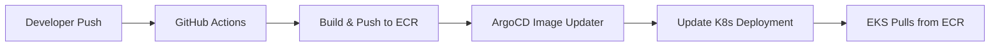

# AWS ECR Container Registries

> **📦 OPTIONAL**: This directory creates AWS Elastic Container Registry (ECR) repositories for storing your Docker images. Only deploy this if you need AWS-hosted container registries.

## 📋 Overview

This configuration creates ECR repositories in AWS for storing and managing your container images. ECR provides secure, scalable, and reliable container image storage integrated with your AWS infrastructure.

### 🎯 Purpose

- **Container Storage**: Secure Docker image repositories in AWS
- **Integration**: Native integration with EKS and other AWS services
- **Security**: Private repositories with IAM-based access control
- **Lifecycle**: Automated image lifecycle policies

## 🚀 Quick Start

### 1. Configure Repository Settings

```bash
# Navigate to ECR directory
cd global/repos-ecr

# Copy example configuration
cp terraform.tfvars.example terraform.tfvars

# Edit with your settings
nano terraform.tfvars
```

### 2. Customize Configuration

```terraform
# Example configuration
region = "eu-central-1"                    # Your AWS region
bucket = "your-terraform-state-bucket"     # Your state bucket name

# Repository names for your applications
repository_names = [
  "my-web-app",
  "api-service", 
  "background-worker",
  "nginx-proxy"
]

# GitHub repositories for OIDC integration (if using CI/CD)
# NOTE: This variable should also be updated in:
# - eks-karpenter/global/github-oidc/ for CI/CD integration
# - eks-karpenter/environments/dev/ for ArgoCD and image updater integration
github_repos = [
  "your-org/your-app-repo",
  "your-org/your-infrastructure-repo"
]
```

### 3. Update GitHub Integration (Important)

> **⚠️ CONSISTENCY REQUIRED**: The `github_repos` variable should be consistent across multiple locations for proper integration:

```bash
# Update the same GitHub repositories in these locations:

# 1. For CI/CD Pipeline Integration (build and push images)
# File: global/github-oidc/terraform.tfvars
github_repos = [
  "your-org/your-app-repo",
  "your-org/your-infrastructure-repo"
]

# 2. For ArgoCD and Image Updater Integration (deploy images)
# File: environments/dev/terraform.tfvars (and environments/pro/terraform.tfvars)
github_repos = [
  "your-org/your-app-repo",
  "your-org/your-infrastructure-repo"
]

# 3. For ECR Repository Access (this file)
# File: global/repos-ecr/terraform.tfvars
github_repos = [
  "your-org/your-app-repo",
  "your-org/your-infrastructure-repo"
]
```

### 4. Deploy ECR Repositories

```bash
# Initialize and deploy
terraform init
terraform plan
terraform apply
```

## 📦 What Gets Created

### ECR Repositories
- **Private repositories** for each application
- **Lifecycle policies** to manage image retention
- **Repository policies** for secure access
- **Scan on push** for vulnerability detection

### Repository Features
- **🔐 Private Access**: Only accessible with proper IAM permissions
- **🔄 Lifecycle Management**: Automatic cleanup of old images
- **🛡️ Security Scanning**: Vulnerability scanning on image push
- **📊 CloudWatch Metrics**: Monitoring and logging integration

## 🔧 Configuration Files

| File | Purpose | Action Required |
|------|---------|----------------|
| `main.tf` | ECR repository configuration | ✅ Ready to use |
| `variables.tf` | Variable definitions | ✅ Ready to use |
| `outputs.tf` | Repository URLs and ARNs | ✅ Ready to use |
| `backend.tf` | Terraform state backend | ⚠️ Update bucket name |
| `terraform.tfvars.example` | Example configuration | 📝 Copy and customize |

## 🐳 Using Your ECR Repositories

### 1. Authenticate Docker with ECR

```bash
# Get login token and authenticate
aws ecr get-login-password --region eu-central-1 | \
  docker login --username AWS --password-stdin <account-id>.dkr.ecr.eu-central-1.amazonaws.com
```

### 2. Build and Tag Images

```bash
# Build your image
docker build -t my-web-app .

# Tag for ECR
docker tag my-web-app:latest <account-id>.dkr.ecr.eu-central-1.amazonaws.com/my-web-app:latest
```

### 3. Push to ECR

```bash
# Push image
docker push <account-id>.dkr.ecr.eu-central-1.amazonaws.com/my-web-app:latest
```

### 4. Use in EKS Deployments

```yaml
# Kubernetes deployment example
apiVersion: apps/v1
kind: Deployment
metadata:
  name: my-web-app
spec:
  template:
    spec:
      containers:
      - name: app
        image: <account-id>.dkr.ecr.eu-central-1.amazonaws.com/my-web-app:latest
```

## 🔒 Security & Access

### IAM Permissions Required

For CI/CD pipelines and developers:

```json
{
  "Version": "2012-10-17",
  "Statement": [
    {
      "Effect": "Allow",
      "Action": [
        "ecr:GetAuthorizationToken",
        "ecr:BatchCheckLayerAvailability",
        "ecr:GetDownloadUrlForLayer",
        "ecr:BatchGetImage",
        "ecr:PutImage",
        "ecr:InitiateLayerUpload",
        "ecr:UploadLayerPart",
        "ecr:CompleteLayerUpload"
      ],
      "Resource": "*"
    }
  ]
}
```

### Repository Access

- **Push Access**: Developers and CI/CD pipelines
- **Pull Access**: EKS cluster and deployment tools
- **Admin Access**: Infrastructure team for repository management

## 📊 Lifecycle Policies

Automatic image cleanup policies are configured:

- **🏷️ Keep Tagged**: Tagged images kept for 30 days
- **🔢 Keep Recent**: Last 10 untagged images retained
- **🧹 Auto Cleanup**: Older images automatically removed
- **💰 Cost Optimization**: Reduces storage costs

## 🔍 Monitoring & Logging

### CloudWatch Metrics
- Repository size and image count
- Push/pull activity metrics
- Scan results and vulnerabilities

### Logging Integration
- All API calls logged to CloudTrail
- Repository events in CloudWatch Events
- Integration with AWS Config for compliance

## 🆘 Troubleshooting

### Common Issues

#### Authentication Failed
```
Error: authentication required
```
**Solution**: Refresh ECR login token
```bash
aws ecr get-login-password --region eu-central-1 | \
  docker login --username AWS --password-stdin <account-id>.dkr.ecr.eu-central-1.amazonaws.com
```

#### Repository Not Found
```
Error: repository does not exist
```
**Solution**: Ensure repository name matches exactly and region is correct

#### Permission Denied
```
Error: access denied
```
**Solution**: Check IAM permissions for ECR actions listed above

#### Image Too Large
```
Error: image size exceeds limit
```
**Solution**: ECR supports up to 10GB per image. Optimize your Docker image size.

## 🚫 When NOT to Use ECR

Consider alternatives if:

- **🌐 Public Images**: Use Docker Hub for public images
- **💰 Cost Sensitive**: ECR has storage and transfer costs
- **🔄 Multi-Cloud**: Need cross-cloud portability
- **🏢 Existing Registry**: Already using Harbor, Nexus, or other registry

## � GitHub Integration Workflow

### Repository Configuration Consistency

The `github_repos` variable enables different integration points in your infrastructure:

#### 1. **CI/CD Pipeline** (`global/github-oidc/`)
- **Purpose**: Allows GitHub Actions to push images to ECR
- **Integration**: OIDC authentication for CI/CD workflows
- **Permissions**: ECR push/pull access for automated builds

#### 2. **ArgoCD & Image Updater** (`environments/dev|pro/`)
- **Purpose**: Enables ArgoCD Image Updater to monitor ECR repositories
- **Integration**: Automatic image updates in Kubernetes deployments
- **Permissions**: ECR read access for image discovery and updates

#### 3. **ECR Access Control** (`global/repos-ecr/`)
- **Purpose**: Configures repository-level access policies
- **Integration**: IAM role assignments for ECR repositories
- **Permissions**: Repository-specific access controls

### Complete Integration Flow



1. **Developer pushes code** → GitHub repository
2. **GitHub Actions builds** → Uses OIDC to push images to ECR
3. **ArgoCD Image Updater monitors** → ECR for new image versions
4. **Automatic deployment** → Updates Kubernetes manifests
5. **EKS pulls images** → From ECR repositories using Pod Identity

## �🔄 Integration with EKS

### Automatic Integration
- **Pod Identity**: EKS pods can pull images without credentials
- **Image Pull Secrets**: Automatically configured
- **Security Scanning**: Integrated with EKS security features
- **Networking**: VPC endpoints for private access

### Best Practices
- Use specific image tags, avoid `latest`
- Implement image scanning in CI/CD
- Regular vulnerability assessment
- Proper tagging strategy for environments

## 📚 Related Documentation

- **Main Repository**: [../../README.md](../../README.md) - Full deployment guide
- **S3 Bucket Setup**: [../create-bucket/README.md](../create-bucket/README.md) - State bucket creation
- **GitHub OIDC Setup**: [../github-oidc/README.md](../github-oidc/README.md) - CI/CD configuration
- **Environment Deployment**: [../../environments/](../../environments/) - EKS cluster setup

## 🎯 Next Steps

After ECR deployment:

1. **✅ Repositories Created**: ECR repositories ready for images
2. **🐳 Push Images**: Build and push your container images
3. **🚀 Deploy to EKS**: Update Kubernetes manifests with ECR image URLs
4. **🔄 Setup CI/CD**: Configure automated builds and deployments

---

**💡 Tip**: ECR repositories are independent of EKS clusters - you can use them with any container orchestration platform!